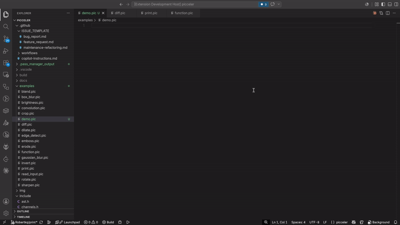

# Picceler Language Support for Visual Studio Code

Official syntax highlighting and language configuration for **Picceler**—a custom DSL for image processing and hardware acceleration.

  

## Features

Describe specific features of your extension including screenshots of your extension in action. Image paths are relative to this README file.

* **Syntax Highlighting**: Rich tokenization for Picceler functions (`def`, `return`), comments (`#`), strings, numbers, and operators.
* **Types**: `int64`, `float64`, `string`, `image`, `kernel` are highlighted as `storage.type` — most
  themes (including VS Code's built-in Dark+) render this in blue.
* **Built-in Dialect Ops**: Full highlighting for native image processing intrinsics, scoped as
  `support.function.builtin.*` — most themes render this in yellow:
  * **I/O & Utilities**: `load_image`, `save_image`, `show_image`, `print`, `read_string`, `read_number`
  * **Math**: `sqrt`, `pow`
  * **Filters**: `brightness`, `invert`, `sharpen`, `box_blur`, `gaussian_blur`, `edge_detect`, `emboss`, `rotate`
  * **Algorithms & Morphology**: `convolution`, `erode`, `dilate`, `diff`, `blend`, `crop`
* **Language Intelligence**: Hover docs, signature help (parameter hints while typing a call), and
  snippet completion for every builtin function — e.g. typing `box_blur(` shows
  `box_blur(image img, int64 radius) -> image`. This is static (a hardcoded table, not real
  type-checking), so it can't catch a wrong-typed argument, only show the expected shape.
* **Language Integration**: Automatic file detection for `.pic` scripts, comment toggling (`#`), and auto-closing bracket/quote pairs.

---

## Requirements

* No external runtime or Node.js dependencies are required for syntax highlighting!
* To compile `.pic` source files, ensure you have the `picceler` binary installed and accessible in your system path.

---

## Extension Settings

* This extension does not contribute any custom configuration settings. Syntax highlighting relies
  on native VS Code tokenization (the TextMate grammar); hover/signature-help/completion are
  provided by a small bundled `extension.js` (no third-party dependencies).

---

## Known Issues

* None reported at this time. If you run into syntax rendering issues or missing ops, feel free to open an issue on the repository!

---

## Release Notes

See [CHANGELOG.md](CHANGELOG.md) for release notes.

---

## Publishing

Releases are published manually — see [HOWTO.md](HOWTO.md) for how to package and publish a new
version.

---

## Developer note

* **AI Assistance:** This extension, its syntax highlighting configurations, and supporting scripts were built with heavy reliance on AI tools. 
* **Asset Credits:** The extension icon was generated using AI. 
* **Design Philosophy:** Written as a pragmatic wrapper to handle basic editor tooling and language support for Picceler—because spending hours manually writing boilerplate editor extensions by hand isn't worth the time.

# Please Enjoy! 